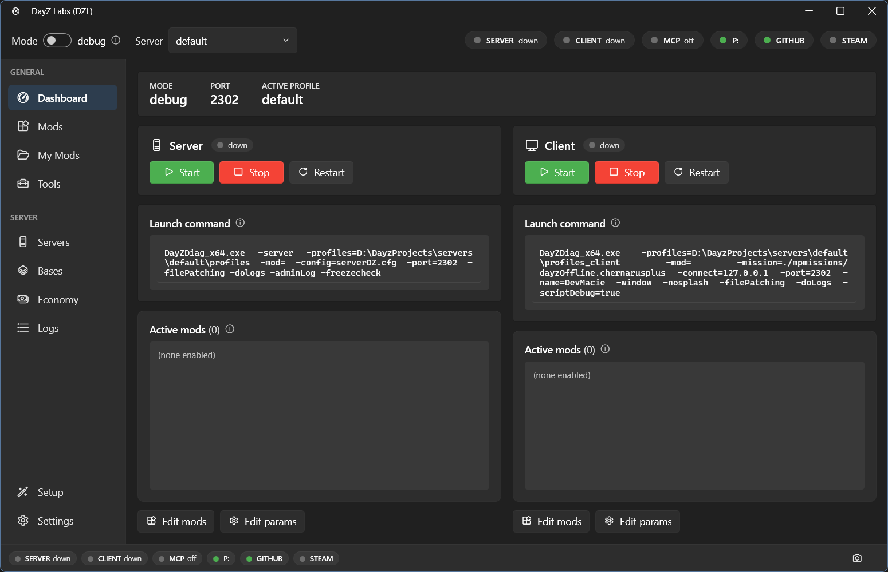

# DayZ Labs — `dzl`

`dzl` is a DayZ mod-development launcher for Windows. It starts and stops the DayZ dev server and
client, manages an ordered mod selection plus named config presets, tails and diagnoses the DayZ
logs, and wraps the DayZ Tools — Addon Builder, ImageToPAA, CfgConvert, the **P:** work drive, and
more. On top of that it adds a validating build pipeline, Central Economy editors, Steam Workshop
downloads, and git/GitHub integration. One engine ships three ways: a CLI, an MCP server (so an AI
agent like Claude can drive it), and a WPF system-tray app.



## Download

**[⬇ Download the installer — `DayZLabs-win-Setup.exe`](https://github.com/Borcioo/dayz-labs/releases/latest/download/DayZLabs-win-Setup.exe)**  ·  [all releases](https://github.com/Borcioo/dayz-labs/releases)

- **Per-user install, no admin.** Lands in `%LocalAppData%\DayZLabs` and adds the `dzl` command to your PATH.
- **Auto-updates** from GitHub Releases — the tray checks on launch and offers to update itself.
- **Self-contained** — you do **not** need the .NET runtime to run it.
- **Unsigned (early release):** Windows SmartScreen shows an "unknown publisher" prompt on first run —
  click *More info → Run anyway*. Every release is **scanned on VirusTotal** (link in the release notes),
  so you can verify the binary is clean.
- Uninstall from **Settings → Apps**, or the tray's **Uninstall dzl…** (with an option to also remove
  your settings). Your mod project folders and signing keys are never touched.

On first launch (no config yet) a **setup wizard** runs: it detects DayZ + DayZ Tools, mounts the P:
work drive, extracts vanilla game data, sets your **project folder** (where mods, builds, server
instances, and keys live), and scaffolds a server instance.

## Requirements

- **Windows.**
- **DayZ** and **DayZ Tools**, both installed via Steam — they provide Addon Builder, ImageToPAA,
  CfgConvert, the WorkDrive, etc.
- Optional, per feature: **steamcmd** (Workshop downloads), the **GitHub CLI** (`gh`, for publishing
  repos / cutting releases), and a **Steam Web API key** (Workshop search).

## What it does

- **Server / client lifecycle** — start, stop, restart the dev server and client in `debug` (DayZDiag)
  or `normal` (release) mode. Spawned PIDs are tracked so a recycled PID is never mistaken for a live
  server.
- **Ordered mods + named presets** — an ordered mod selection where each mod is tagged
  `both` / `server` / `client` (server-only mods go to `-serverMod`, the rest to `-mod`). Full config
  snapshots are saved as named presets you can switch between.
- **Log tailing + diagnosis** — read the last N lines of any DayZ log, and run a diagnoser that
  pattern-matches known failure signatures (verification kicks such as `VE_MISSING_BISIGN` /
  `VE_PATCHED_PBO`, mod version skew, build-tool symptoms) into cause → fix entries.
- **DayZ Tools wrappers** — discover and launch the DayZ Tools GUIs, batch-convert textures to PAA,
  pack folders into PBOs, and unbinarize configs. Mount / unmount the **P:** work drive without opening
  the Tools GUI.
- **Build pipeline** — build a mod project into a PBO with a preflight gate (config sanity,
  missing/excluded asset references, baked absolute paths, path-hygiene rules, Enforce-script traps),
  optional binarization and signing, a content-hash build cache that skips unchanged mods, and
  post-build verification.
- **Signing keys** — create your creator key pair once; one key signs all your mods.
- **Central Economy editors** — edit a mission's `types.xml` and the rest of the CE config (events,
  globals, spawnable types, random presets, player spawns) with linting and versioned backups.
- **Steam Workshop** — search the Workshop (Steam Web API) and download/update items via steamcmd.
- **git / GitHub integration** — treat a mod project as a git repo: status, changes, log, diff, commit,
  branches, push/pull, publish a new GitHub repo, and cut releases.
- **Three frontends, one core** — a CLI, an MCP server for AI agents, and a WPF tray app, all over the
  shared `Dzl.Core` engine.

## Documentation

Guides and the full feature tour live at **[borcioo.github.io/dayz-labs](https://borcioo.github.io/dayz-labs/)**.

## Drive it from an AI agent (MCP)

`dzl` ships an MCP server, so an MCP client such as Claude can call the same operations the app does
(status, start/stop, logs, build, preflight, Central Economy edits, Workshop, git, …). Point your MCP
client at the installed server:

```json
{
  "mcpServers": {
    "dzl": {
      "command": "%LocalAppData%\\DayZLabs\\current\\mcp\\dzl-mcp.exe"
    }
  }
}
```

stdout is the MCP protocol stream, so the server logs only to stderr. See the
[MCP guide](https://borcioo.github.io/dayz-labs/guides/mcp/) for the tool catalog.

## Building from source

Want to hack on dzl itself? You need the **[.NET 8 SDK](https://dotnet.microsoft.com/download/dotnet/8.0)**.

```powershell
dotnet build Dzl.sln -c Debug      # build everything
dotnet test                        # run the tests (xUnit + FluentAssertions)

.\run-dzl.bat                      # build + launch the tray, de-elevated via explorer.exe
```

`run-dzl.bat` launches the tray **de-elevated**: the tray mounts the **P:** work drive, and a mounted
drive is only visible in the session that mounted it — so an elevated tray would mount P: where the
(non-admin) game and Explorer can't see it. Prefer this script over `dotnet run` for the tray.

A short CLI tour:

```powershell
dotnet run --project src/Dzl.Cli -- status            # launcher status
dotnet run --project src/Dzl.Cli -- start --client    # start server + client (debug)
dotnet run --project src/Dzl.Cli -- logs script --lines 100
dotnet run --project src/Dzl.Cli -- preflight MyMod   # validate before building
dotnet run --project src/Dzl.Cli -- build MyMod --sign
```

Run `dotnet run --project src/Dzl.Cli -- --help` for the full command list. The release installer is
built by `scripts/pack.ps1` (Velopack) and published on a `v*` tag by `.github/workflows/release.yml`.

## License

`dzl` is licensed under the **GNU General Public License v3.0** — see [LICENSE](LICENSE).

Copyright © 2026 Borcioo (DayZ Labs).

## Disclaimer

DayZ Labs (`dzl`) is an unofficial, community-made tool. It is **not affiliated with,
endorsed by, or authorized by Bohemia Interactive a.s.** Bohemia Interactive, ARMA, DAYZ,
ENFUSION and all associated logos and designs are trademarks or registered trademarks of
Bohemia Interactive a.s.
