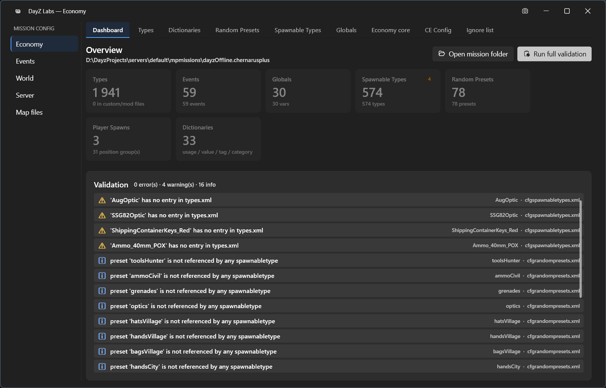

A DayZ server's loot, events, and player spawns are controlled by a set of XML files — the
**Central Economy** — and hand-editing them is error-prone: one unknown category or typo'd tag
and the mission silently misbehaves. DayZ Labs gives you a built-in editor for those files that
understands the format, checks your work as you go, and keeps a safety net of backups.

You open it from **Economy** in the app's left navigation (under SERVER). It opens in its own
window so you can keep editing while the rest of the app is in view.

*The Economy window: a Dashboard with live counts and a validation list, plus a tab for each kind of CE file.*

## The Dashboard

The Economy window opens on a **Dashboard** that gives you the whole picture at a glance:
live counts of your Types, Events, Globals, Spawnable Types, Random Presets, Player Spawns,
and Dictionaries, alongside a validation list.

That validation list collects everything the editor noticed across your files — split into
**errors, warnings, and info** — so problems are visible before you ever launch the server.
A **Run full validation** button re-checks the entire economy on demand. The editor lints each
entry against the mission's own `cfglimitsdefinition` vocabulary and flags unknown categories,
duplicate names, and structural problems that DayZ would otherwise swallow silently.

## Editing each kind of file

A row of tabs along the top takes you to a dedicated editor for each part of the economy:

- **Types** — your `types.xml` loot table: spawn counts, lifetimes, tiers, and categories.
- **Dictionaries** — the limit definitions that everything else is checked against.
- **Random Presets** — cargo and attachment loot groups.
- **Spawnable Types** — what gear items and infected spawn with.
- **Globals** — mission-wide economy settings.
- **Economy core** — the master switches for which CE systems run.
- **CE Config** — the file list that ties the economy together.
- **Ignore list** — entries you want validation to skip.

A left rail groups your files by area — **Economy, Events, World, Server, Map files** — so it's
easy to jump between the loot table, the events file, world data, and the server's own config
without hunting through folders.

Each entry is labelled by where it came from — vanilla, a mod, or your own custom value — so you
always know what you're changing and won't accidentally clobber someone else's content.

## Your safety net

Every edit snapshots the file before writing, and the editor keeps the most recent **versioned
backups**. So if a change doesn't pan out, the previous version is still there to roll back to —
you're never one bad save away from a broken mission.

## Power users and automation

Everything above is point-and-click in the app. If you script your workflow or drive DayZ Labs
from an AI agent, the bundled MCP server and the CLI can also list, edit, lint, and restore your
`types.xml` — handy for batch checks in CI or letting an assistant fix entries for you. That's an
optional extra on top of the editor, not the way most people work.

[Go deeper →](/dayz-labs/guides/central-economy/)
