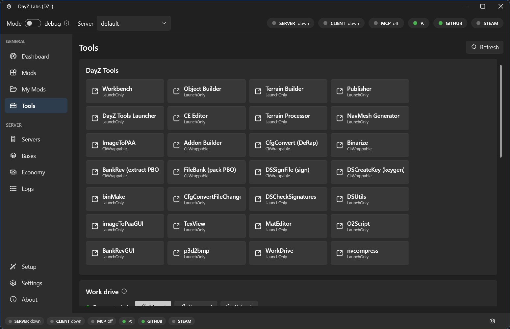

DayZ modding leans on a pile of separate tool windows — Workbench, Object Builder, Terrain
Builder, Addon Builder, ImageToPAA, CfgConvert, Binarize — and a special **P:** work drive
they all expect to be mounted. The **Tools** page in DayZ Labs gathers those tools into one
grid so you can launch any of them with a click, and it mounts or unmounts the P: drive for
you from the same screen.

*The Tools page: a grid of the DayZ Tools plus the P: work-drive mount control.*

## The tools grid

Each tile in the grid is one of the DayZ Tools that ships with the official DayZ Tools
package — Workbench, Object Builder, Terrain Builder, Addon Builder, ImageToPAA, CfgConvert,
Binarize and the rest. Click a tile and DayZ Labs launches that tool for you, wired up to the
paths it already knows about, so you don't have to hunt for the right `.exe` under your DayZ
Tools install.

For DayZ Labs to find these, point it at your DayZ Tools folder once in **Settings → Paths**
(or let the first-run wizard auto-detect it — see the
[getting-started guide](/dayz-labs/guides/getting-started/)). After that the grid just works.

## The P: work drive

Most of the DayZ Tools — and the game itself — expect a mounted **P:** drive that holds the
vanilla game data. The Tools page has a single control to **mount** or **unmount** it, and a
**P:** status pill on the Dashboard shows you at a glance whether the drive is currently up.

There's one important detail DayZ Labs handles for you. The P: drive only behaves if it's
mounted **in your normal user session**. Mount it as an administrator and it lands in an
invisible session the game and the tools can't read. Because DayZ Labs runs per-user (no admin
needed), the drive ends up where everything expects it — actually there when the tools and the
game look for it.

The first-run setup wizard mounts P: and extracts the vanilla game data for you, so on a fresh
machine you usually don't have to touch this at all. The mount control on the Tools page is for
later, when you want to remount after a reboot or free the drive up.

## What you can do here

- Launch any of the DayZ Tools GUIs with one click.
- Mount, check, or unmount the P: work drive — without opening the DayZ Tools at all.
- Keep the everyday tools and the drive they depend on in one place, instead of chasing
  separate windows.

Building a mod into a PBO has its own front-and-center spot too: your source projects each get a
one-click **Build** button on the **My Mods** page — see the
[build pipeline](/dayz-labs/features/build-pipeline/).

## Power users & automation

Everything on this page is also scriptable. The bundled CLI and MCP server expose the same
tool launching and P: drive actions, so you can drive them from a terminal or let Claude do it
for you. That's an optional extra for automation — see the [MCP page](/dayz-labs/guides/mcp/).
For normal day-to-day modding, the Tools page is all you need.
