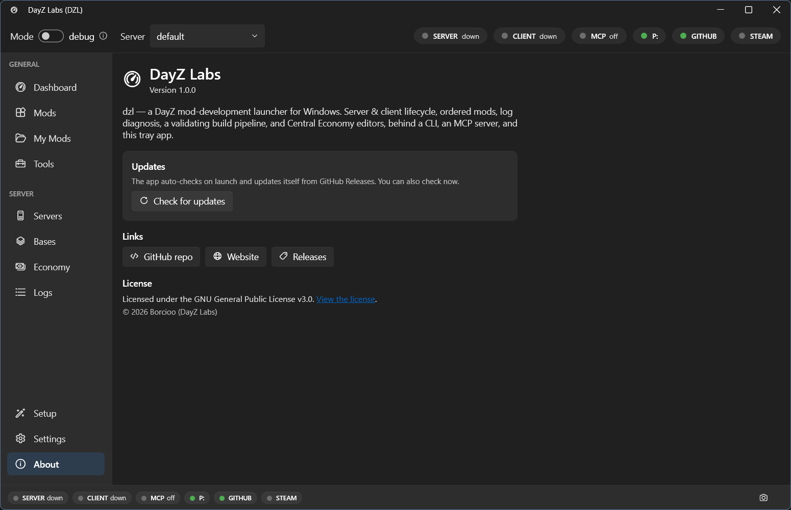

Everything dzl can do lives in a single engine, and three different frontends sit on top of
it. Because they're all thin shells over the same core, they behave identically — so the work
you do in one shows up in the others.

For almost everyone, the frontend is the **tray app**: the Windows desktop app you install from
[the releases page](https://github.com/Borcioo/dayz-labs/releases). It's where you click
buttons to start and stop your server and client, manage mods, build your projects, edit the
Central Economy, and tail your logs. The CLI and the MCP server are extras for power users and
automation, built on the very same engine.

## The tray app — what you install and use

You download `DayZLabs-win-Setup.exe`, run it (no admin needed — it installs just for you), and
it keeps itself up to date from GitHub Releases. The first launch walks you through a short setup
wizard: confirm your DayZ and DayZ Tools paths, pick your main project folder, mount the **P:**
work drive, extract the vanilla game data, and create your first server.

After that, everything lives in the left-hand navigation:

- **Dashboard** — your home base. Flip between debug and normal mode, pick a server, and use the
  Server and Client cards to Start / Stop / Restart with a live preview of the exact launch
  command and your active mods.
- **Mods** and **My Mods** — your discovered mod library, plus your own source projects with a
  one-click Build button and git actions.
- **Tools** — the DayZ Tools (Workbench, Object Builder, Addon Builder, ImageToPAA, and the
  rest) launched straight from the app, plus the P: work-drive mount/unmount.
- **Servers**, **Bases**, **Economy**, and **Logs** — manage server instances, edit the Central
  Economy in its own window, and watch the Script / RPT / ADM / Client logs live.
- **Setup**, **MCP**, **Settings**, and **About** — re-run the wizard, read about the bundled MCP
  server, manage your accounts and paths, and check for updates.

*The About page shows your installed version, a Check for updates button, and links to the repo, site, and releases.*

## The CLI — for power users and automation

If you like the keyboard or want to script your build-and-test loop, dzl also ships a command-line
interface. It exposes the same actions as the tray — status, start/stop, logs, build — so you can
wire dzl into batch files or your own tooling. It's an optional extra; you never need it to use
the app.

## The MCP server — let an AI agent drive dzl

dzl bundles an MCP server so an AI agent like Claude can operate the launcher for you: check
status, start the server, read and diagnose logs, build mods, edit the economy, and more. It
speaks over stdio, so any MCP client can connect. The installed server lives at
`%LOCALAPPDATA%\DayZLabs\current\mcp\dzl-mcp.exe`.

## Why one core matters

Because all three frontends share the same engine and live state, they stay in sync. Start your
server from the tray, and the CLI and an AI agent both see it running. Edit a mod loadout in one
place, and it's the loadout everywhere. You pick whichever frontend fits the moment instead of
learning three separate tools.

[Go deeper →](/dayz-labs/guides/mcp/)
