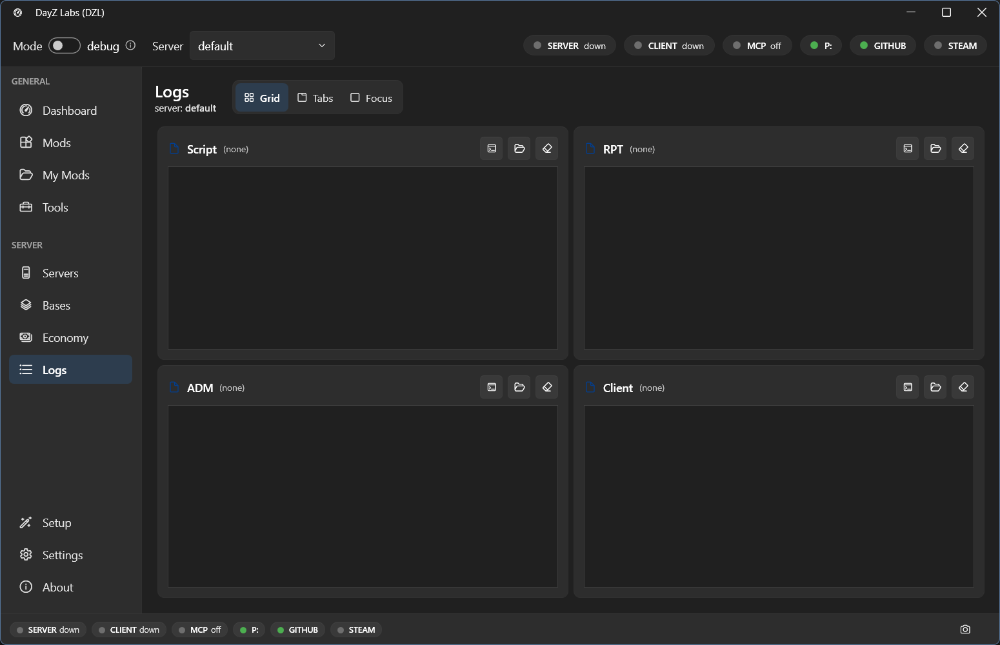

When a mod misbehaves, the answer is almost always in a log file — if you can find the right
one and read past the noise. DayZ Labs tails all four DayZ logs (**script**, **rpt**, **adm**,
and the **client** log) for you, right inside the app, and then goes a step further: it scans
the output for known failure signatures and explains them in plain "cause → fix" terms.

Instead of staring at a wall of red text, you get a short list of what actually went wrong —
a mod whose signature was rejected, a version mismatch between client and server, a build-tool
symptom — each paired with what to do about it.

## The Logs page

Open **Logs** from the left navigation. It shows a live tail of all four logs as your server
and client run, so you can start a test and watch what happens without ever opening a file by
hand.



*The Logs page tails the script, rpt, adm, and client logs side by side.*

You can switch how the logs are arranged to suit what you're doing:

- **Grid** — all four logs visible at once, good for spotting which one lit up.
- **Tabs** — one log at a time, full width, for reading a single stream closely.
- **Focus** — zoom in on the one log you care about right now.

New lines append as the game writes them, so you can reproduce a problem and see it land in
real time.

## What each log is for

- **Script** — your Enforce Script `Print`/errors and most mod-side crashes. This is the one
  you'll read most.
- **RPT** — the engine-level report log: startup, mod loading, signature checks, hard crashes.
- **ADM** — the admin/gameplay log (connections, kills, player actions).
- **Client** — the client-side equivalent, for when the problem is on the player's end.

## Plain-language diagnosis

Reading the raw tail is fine, but DayZ Labs can also do the first pass for you. It scans the
log output for known failure signatures and turns them into short cause-and-fix entries, so you
don't have to recognise every cryptic line yourself.

It's especially good at the common "why did it kick me" failures:

- A mod whose signature is missing or was rejected.
- A version mismatch between client and server.
- Build-tool symptoms that show up as runtime errors.

Each match comes back as a plain explanation of what went wrong and what to do about it,
instead of a wall of red text you have to decode.

## Power users & automation

The same live tail and diagnosis are available outside the app for scripting and CI. The
bundled MCP server lets Claude read and diagnose the logs for you, and the command-line tool
exposes the same thing:

```powershell
dzl logs script --lines 100      # tail the last 100 lines
dzl logs script --diagnose       # run the diagnoser over the tail
```

Most people never need this — the **Logs** page covers everyday work. See
[Three frontends, one core](/dayz-labs/features/frontends/) for the CLI and MCP details.
