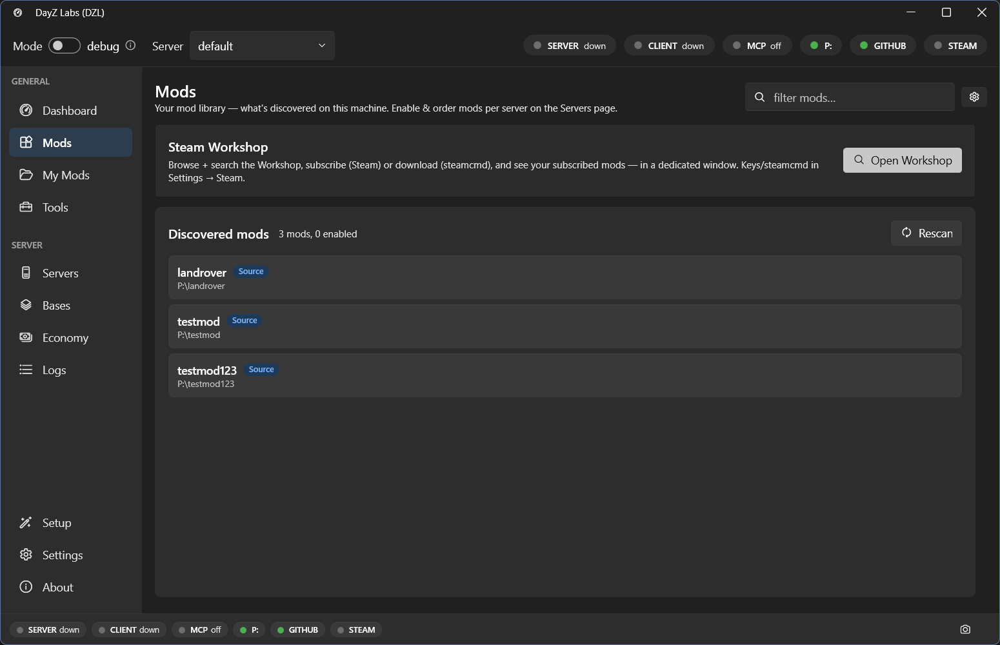

Most servers run with other people's mods, and you usually grab those from the Steam Workshop.
DayZ Labs brings that into the app: you can search the Workshop and pull items down without
juggling a separate tool, and the downloaded mods show up right alongside your own in the
**Mods** library.

## The Mods page

Open **Mods** in the left navigation (under GENERAL) to see every mod DayZ Labs has discovered
on this machine. From here you can tick the ones you want active, reorder them, and reach the
Workshop with the **Open Workshop** button at the top.

*Your discovered mod library. The Open Workshop button is where you search for and download new items.*

## Searching and downloading

From the Workshop view you can:

- Search the Workshop by name to find an item and its id.
- Download a Workshop item so it lands in your library, ready to add to a run.
- Update a single item, or update everything you've downloaded, in one go.

Once an item finishes downloading it appears in the Mods list like any other mod — tick it on,
and it'll be part of the launch command you see on the **Dashboard** Server and Client cards.

## About the Steam login

Downloads go through **steamcmd**, which opens its own console window for the Steam login and
Steam Guard prompt. That's normal: steamcmd handles your credentials directly in that console,
you approve the Guard challenge once, and it remembers the session so later downloads usually
don't ask again.

Searching the Workshop by name needs a Steam Web API key. You can add your Steam account, along
with the key, under **Settings → Accounts**. Downloading by id works without it.

## Power users and automation

If you script your setup or drive DayZ Labs from Claude, the same Workshop search and download
actions are available through the CLI and the bundled MCP server. For everyday modding, though,
the Mods page is all you need.

[Go deeper →](/dayz-labs/guides/workshop/)
