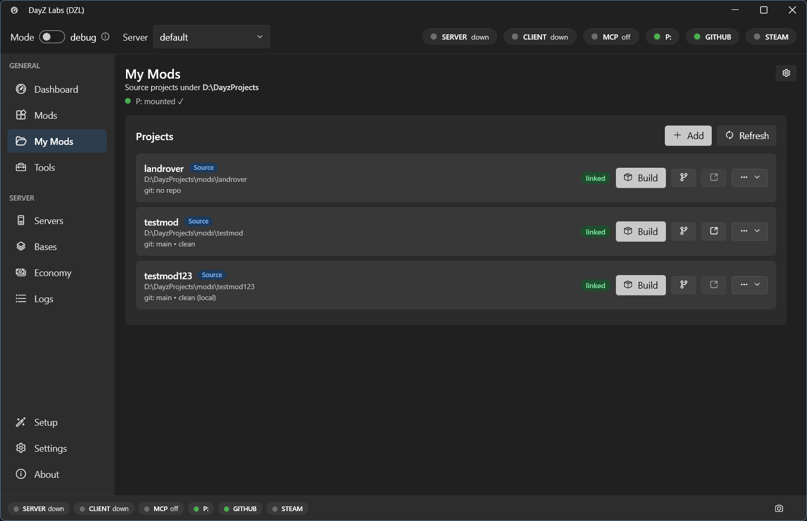

When you are working on a mod, you eventually need to turn your source folder into a
packed `.pbo` that DayZ can load. In DayZ Labs you do that with one click on the **My Mods**
page — no command line, no juggling Addon Builder by hand.

## The My Mods page

Open **My Mods** from the left navigation (under GENERAL). It lists every source mod
project found under your Projects root — the folder you chose during the setup wizard
(default `%USERPROFILE%\DayZProjects`). Each project gets its own row.

*Each source project gets a row with a Build button, git actions, and an open-folder button.*

On every row you'll find:

- A **Build** button — packs that mod into a PBO (covered below).
- **Git actions** — for projects that are git repositories, so you can see changes and commit
  without leaving the app.
- An **open-folder** button — jumps straight to the project folder in Explorer.

## Building a mod

Click **Build** on a mod's row. That single click runs a small pipeline for you, not just
a raw Addon Builder call:

1. **Preflight gate.** Before anything is packed, DayZ Labs scans your source for the common
   "why is my mod broken" problems — bad config structure, missing texture or model
   references, baked-in `P:\...` absolute paths that work on your machine but break on every
   other one, uppercase paths that break Linux servers, textures you edited but forgot to
   re-convert, and a few Enforce-script traps. Error-level findings stop the build so you fix
   them first; warnings just get noted.
2. **Skip-if-unchanged.** DayZ Labs remembers a content fingerprint of each mod. If nothing
   that affects the output has actually changed since the last build, it skips the build
   instantly instead of repacking. This is content-based, so a fresh git checkout (which only
   bumps file timestamps) won't trick it into needless rebuilds.
3. **Pack and sign.** The mod is packed into a PBO, optionally binarized, and — if you have a
   signing key — signed. A signature proves your PBO wasn't tampered with; servers that verify
   signatures reject unsigned ones.
4. **Verify.** Addon Builder can fail quietly or even report success while the log says
   otherwise, so DayZ Labs treats a fresh PBO actually appearing as the real proof of success
   and summarizes any errors or missing references it found.
5. **Publish.** The finished PBO is dropped into place atomically (no half-written output) so
   the server only ever sees a complete build.

### Where the build lands

The packed output goes into the **`build/`** folder under your Projects root, ready to be
loaded by a server instance. You don't have to copy anything by hand — once the build
succeeds, the mod is in place for your active server to pick up.

### If a build fails

If preflight blocks the build, the findings tell you exactly what to fix — each one has a
clear message and points at the file and line. If Addon Builder itself fails, DayZ Labs
summarizes the error and missing-reference counts and surfaces likely cause-and-fix hints
rather than leaving you to read a noisy log.

## Signing keys

A signing key is created once and signs all your mods. If you haven't set one up, the app
uses the DayZ Tools to create your key pair and stores it in the `keys/` folder under your
Projects root. After that, every build can sign automatically.

## Power users and automation

The Build button is all most people need. If you want to script builds — for CI, batch jobs,
or driving DayZ Labs from Claude — the same pipeline is available through the bundled CLI and
the MCP server. See the [MCP guide](/dayz-labs/guides/mcp/) for the agent-driven workflow, and
[Central Economy](/dayz-labs/guides/central-economy/) for the related config editors.
