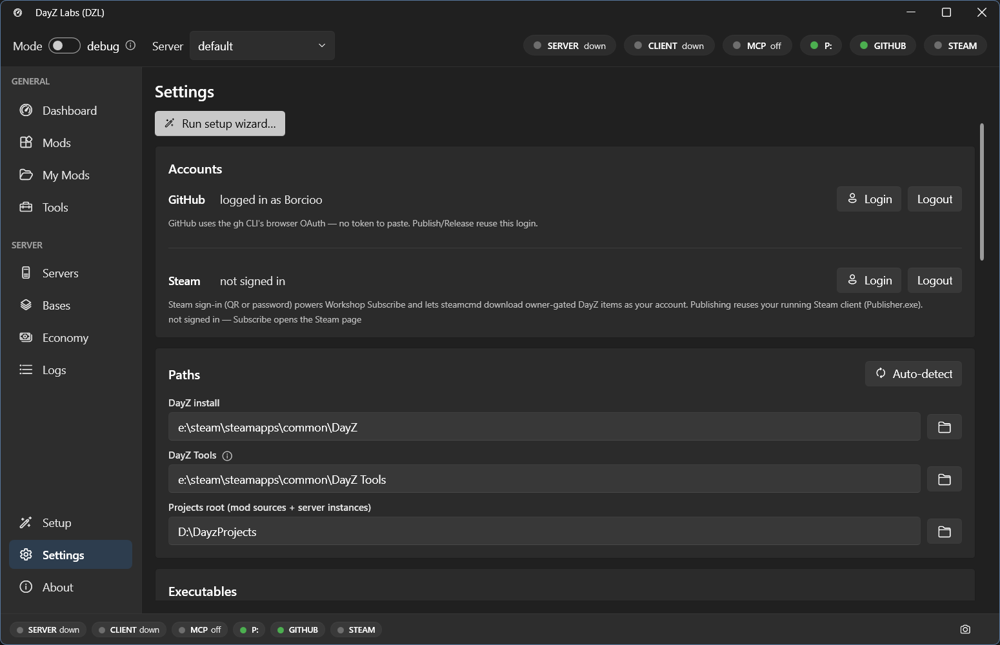

DayZ Labs (`dzl`) is a Windows app for DayZ mod developers. It starts and stops your
local dev server and client, manages your mods and config, and wraps the DayZ Tools —
all from one window. This guide takes you from downloading the installer to a running
server and client.

## What you need first

- **Windows.**
- **DayZ** and **DayZ Tools**, both installed through Steam.

That's it. You don't need any developer tools or a code editor to run DayZ Labs.

## 1. Download and install

1. Go to the [Releases page](https://github.com/Borcioo/dayz-labs/releases).
2. Download **`DayZLabs-win-Setup.exe`** from the latest release.
3. Run it.

The installer is **per-user** — it installs just for your account and does **not** ask for
administrator rights. Once installed, DayZ Labs **keeps itself up to date** automatically
from GitHub Releases, so you won't have to download new versions by hand.

When it finishes, launch **DayZ Labs** from the Start menu.

## 2. First-run setup wizard

The very first time you open the app, a short setup wizard walks you through getting
everything connected. Each step:

1. **Confirm your paths** — the wizard tries to find your **DayZ** install and your
   **DayZ Tools** install. Check that the detected folders are right (or point it at the
   correct ones).
2. **Pick your main project folder** — this is where your mod projects will live. The
   default is `%USERPROFILE%\DayZProjects`.
3. **Mount the P: work drive** — DayZ Tools uses a virtual **P:** drive for vanilla game
   data and as a packing root. The wizard mounts it for you.
4. **Extract vanilla game data** — pulls the base game's files onto P: so your mods have
   something to build against.
5. **Create a server instance** — sets up your first server (its own config, profiles, and
   port) so you have something to launch.
6. **Set your mod scan-roots** — tells the app where to look for installed mods so it can
   list them for you.

You can re-run this wizard any time from **Setup** in the left navigation, near the bottom.



*The Settings page, where the same paths the wizard sets up live. Open it from the bottom of
the left navigation to review or change your DayZ, DayZ Tools, and Projects folders — there's
an **Auto-detect** button if you'd rather let the app find them.*

If you ever need to fix a path later, that's where to go: **Settings** has tabs for
**Accounts** (sign in to GitHub and Steam), **Paths** (DayZ install, DayZ Tools, Projects
root), and **Executables**.

## 3. The Dashboard — launch your server and client

After setup, you land on the **Dashboard**. This is your control center for running the game.


*The Dashboard: the mode toggle and server dropdown up top, status pills, and the Server and
Client cards each with their own Start / Stop / Restart and a live preview of the exact launch
command.*

Here's what you're looking at:

- **Mode toggle (debug / normal)** — *debug* launches the diagnostic DayZ executable with
  extra logging, which is what you want while developing. *normal* runs the regular release
  build, closer to how players will see it.
- **Server dropdown** — picks which of your server instances is active. Whatever you launch
  uses this one.
- **Status pills** — quick health indicators across the top: **SERVER** and **CLIENT** show
  whether each is running, **MCP** shows the automation server, **P:** shows the work drive,
  and **GITHUB** / **STEAM** show whether you're signed in.

Below that are two cards, one for the **Server** and one for the **Client**. Each card has:

- **Start / Stop / Restart** buttons to control that process on its own.
- A **live preview of the exact launch command** — the full command line the app will run,
  updated as you change mode or mods, so there are no surprises.
- The **active mods** list — the mods that will load, in order.
- **Edit mods** and **Edit params** buttons to change the loadout and launch parameters.

To get going: pick **debug** mode, make sure the right server is selected, then press
**Start** on the Server card. Once it's up, press **Start** on the Client card to connect.
Use **Stop** or **Restart** on either card whenever you need to.

## Where your files live

Your config is stored at:

```
%LOCALAPPDATA%\dzl\config.json
```

Your mod projects live under the Projects root you picked in the wizard (default
`%USERPROFILE%\DayZProjects`), organized into `mods/`, `build/`, `servers/<name>/`, and
`keys/`. You don't normally need to touch any of this by hand — the app manages it — but
it's there if you want to peek.

## Power users: CLI and MCP

The desktop app is the main way to use DayZ Labs, but it isn't the only one. The same
engine also ships as a **command-line tool** (handy for scripting and CI) and as a bundled
**MCP server** so an AI assistant like Claude can drive your server, read your logs, and
build your mods for you. If that's your thing, see the
[MCP server guide](/dayz-labs/guides/mcp/).

## Next steps

- [Building mods](/dayz-labs/guides/building-mods/)
- [Central Economy](/dayz-labs/guides/central-economy/)
- [Server instances](/dayz-labs/guides/server-instances/)
- [Steam Workshop](/dayz-labs/guides/workshop/)
- [MCP server](/dayz-labs/guides/mcp/)
