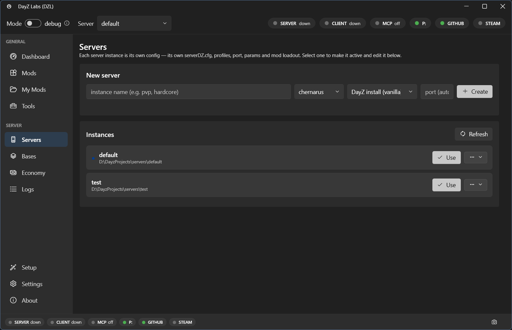

A **server instance** is one complete local DayZ server: its own `serverDZ.cfg`, profile
folders, mission, network port, and list of mods. You can keep as many as you like side by
side — one per map, or a hardcore and a casual version of the same map — and switch which one
is live with a single click. Whichever instance is active is the one the Dashboard launches
and the one the Logs follow.

You manage all of them on the **Servers** page, under **Server** in the left navigation.

## The Servers page

*The Servers page lists every server instance you've created. The active one is marked; the rest are one click away.*

Each row is one server instance. From here you can create a new one, switch which one is
active, and remove ones you no longer need.

## Create a server

1. Open **Server → Servers**.
2. Click **New server**.
3. Give it a **name** (for example `chernarus-test` or `livonia-hardcore`).
4. Pick a **map** (such as Chernarus or Livonia).
5. Pick a **port**, or leave it for dzl to assign a free one.

dzl scaffolds everything that server needs — a fresh `serverDZ.cfg`, profile folders, and a
copy of the mission — and adds it to the list. It does not start running; it just exists,
ready to be made active.

## Switch the active server

Click **Use** on any instance to make it the active one. That's the switch that matters:
everything else in the app follows the active server.

When you switch:

- The **Dashboard** now starts, stops, and previews the launch command for that server.
- The **Logs** page tails that server's script / RPT / ADM logs.
- The mods, launch params, map, and port that belong to that instance come along with it —
  they don't bleed into your other servers.

So you can flip from a test build of one map to a clean copy of another in one click, run it,
read its logs, and switch back, without re-editing any config by hand.

## Why keep several

Because each instance is fully self-contained, there's no reason to overwrite one to try
something. Common setups:

- **One server per map** — Chernarus, Livonia, a custom terrain — each ready to go.
- **Variants of the same map** — a heavily-modded build next to a near-vanilla one for
  comparison.
- **A throwaway** — a scratch server you spin up to reproduce a bug, then delete.

They each carry their own mods, params, and port, so two of them can't collide.

## Bases (templates)

A **base** is a starter template a new instance can be built from, so you don't rebuild the
same `serverDZ.cfg` and mission setup every time. dzl can build a base from your DayZ install
or start you from a blank one. You'll find these under **Server → Bases**.

## Power users and automation

If you script your workflow or drive dzl from an AI agent, the bundled command-line and MCP
tools cover the same operations — creating instances, listing them, and switching the active
one — so you can scaffold and flip servers without opening the window. See the
[MCP server](/dayz-labs/guides/mcp/) guide for details.

## Next steps

- [Building mods](/dayz-labs/guides/building-mods/)
- [Central Economy](/dayz-labs/guides/central-economy/)
- [Steam Workshop](/dayz-labs/guides/workshop/)
