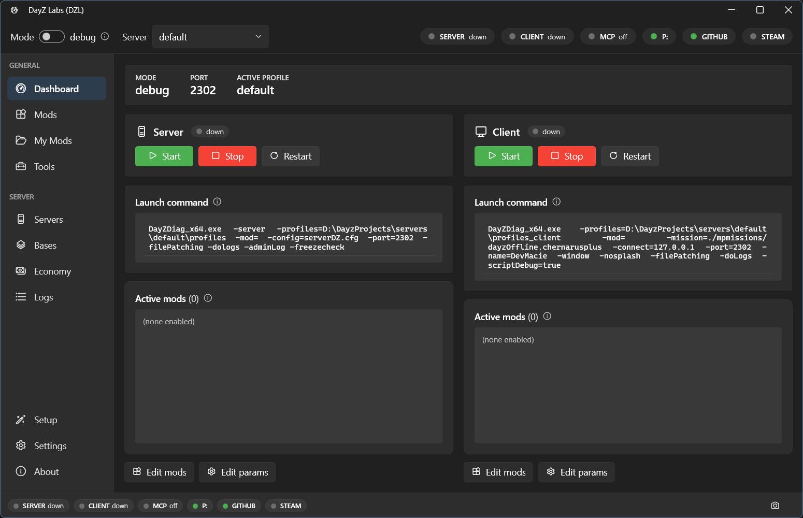

import { Card, CardGrid } from '@astrojs/starlight/components';
import ArchDiagram from '../../components/ArchDiagram.astro';

## What it does

dzl starts and stops your DayZ dev server and client, manages an ordered mod selection plus
named config presets, tails and diagnoses the DayZ logs, and wraps the DayZ Tools (Addon
Builder, ImageToPAA, the **P:** work drive, and more) — then adds a validating build
pipeline, Central Economy editors, Steam Workshop downloads, and git/GitHub integration.

*One installer, no admin rights, and it updates itself. [Download for Windows](https://github.com/Borcioo/dayz-labs/releases/latest/download/DayZLabs-win-Setup.exe) or read the [getting-started guide](/dayz-labs/guides/getting-started/).*

<CardGrid>
  <Card title="Server &amp; client lifecycle" icon="rocket">
    Start, stop, and restart the dev server and client in debug or release mode — with
    tracked PIDs so a recycled process is never mistaken for a live server.
  </Card>
  <Card title="Mods &amp; presets" icon="list-format">
    An ordered mod selection (each tagged server / client / both) saved as named,
    switchable config snapshots.
  </Card>
  <Card title="Logs &amp; diagnosis" icon="error">
    Tail script / rpt / adm / client logs and match known failure signatures into
    cause → fix entries.
  </Card>
  <Card title="Build pipeline &amp; signing" icon="setting">
    A preflight gate, content-hash cache, signing, post-build verification, and atomic
    publish around one Addon Builder call.
  </Card>
  <Card title="Central Economy editors" icon="document">
    Edit types.xml, events, spawns, and the rest of the mission economy with linting and
    versioned backups.
  </Card>
  <Card title="CLI · MCP · Tray" icon="puzzle">
    One core behind three frontends — a command line, an MCP server an AI agent can drive,
    and a WPF tray app.
  </Card>
</CardGrid>

## Three frontends, one core

Every capability lives in a single engine (`Dzl.Core`). The CLI, the MCP server, and the
tray app are thin shells over it, so they behave identically — pick whichever fits your
workflow.

<ArchDiagram />

[See how it fits together →](/dayz-labs/overview/the-big-idea/)
